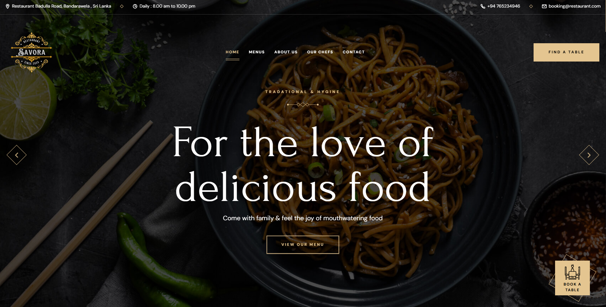

# TukTukTale
# Savora - Restaurant Website





A modern, responsive restaurant website for Savora, featuring authentic Sri Lankan cuisine from the heart of Badulla. This website showcases delicious food offerings, online reservations, and the rich heritage of Sri Lankan flavors.

## 🍽️ Features

- **Modern Responsive Design**: Fully responsive layout that works on all devices
- **Hero Slider**: Dynamic image slider showcasing signature dishes
- **Interactive Menu**: Comprehensive menu display with prices and descriptions
- **Online Reservation System**: Easy-to-use booking form for table reservations
- **About Section**: Story of the restaurant's heritage and tradition
- **Special Dishes**: Highlighted featured items with promotional pricing
- **Customer Testimonials**: Social proof from satisfied customers
- **Contact Information**: Multiple ways to reach the restaurant
- **Newsletter Subscription**: Email subscription for offers and updates

## 🎨 Design Elements

- **Typography**: Google Fonts (DM Sans & Forum) for elegant text styling
- **Animations**: Smooth hover effects and transitions
- **Icons**: Ionicons for consistent iconography
- **Color Scheme**: Warm, inviting colors reflecting Sri Lankan culture
- **Parallax Effects**: Engaging visual elements with depth

## 📱 Sections

1. **Header & Navigation**
   - Restaurant logo and branding
   - Responsive navigation menu
   - Contact information in top bar

2. **Hero Section**
   - Rotating image slider
   - Call-to-action buttons
   - "Book A Table" prominent button

3. **Services**
   - Breakfast, Appetizers, and Drinks categories
   - Visual service cards with hover effects

4. **About Us**
   - Restaurant story and heritage
   - Contact information
   - Visual elements with parallax

5. **Special Dish**
   - Featured item: Lobster Tortellini
   - Promotional pricing display

6. **Menu**
   - Complete menu with images and prices
   - Seasonal and new item badges
   - Operating hours information

7. **Testimonials**
   - Customer reviews and feedback
   - Professional presentation

8. **Reservation Form**
   - Online booking system
   - Contact details and hours
   - Form validation ready

9. **Features Section**
   - Why choose us highlights
   - Hygienic food, fresh environment, skilled chefs

10. **Events**
    - Upcoming events and updates
    - Blog-style cards with dates

11. **Footer**
    - Newsletter subscription
    - Social media links
    - Complete contact information

## 🛠️ Technology Stack

- **HTML5**: Semantic markup structure
- **CSS3**: Modern styling with custom properties
- **JavaScript**: Interactive functionality
- **Ionicons**: Icon library for UI elements
- **Google Fonts**: Typography enhancement

## 📁 Project Structure

```
tuk-tuk-table/
├── index.html
├── assets/
│   ├── css/
│   │   └── style.css
│   ├── js/
│   │   └── script.js
│   └── images/
│       ├── logo.png
│       ├── hero-slider-1.jpg
│       ├── hero-slider-2.jpg
│       ├── hero-slider-3.jpg
│       ├── menu-1.png
│       ├── menu-2.png
│       └── [other images]
└── README.md
```

## 🚀 Getting Started

1. **Clone the repository**
   ```bash
   git clone https://github.com/yourusername/tuk-tuk-table.git
   cd tuk-tuk-table
   ```

2. **Open in browser**
   ```bash
   # Simply open index.html in your preferred browser
   # Or use a local server for development
   ```

3. **For local development**
   ```bash
   # Using Python (if installed)
   python -m http.server 8000
   
   # Using Node.js (if installed)
   npx http-server
   ```

## 📍 Restaurant Information

- **Name**: Savora
- **Location**: Badulla Road, Bandarawela, Sri Lanka
- **Phone**: +94 76 5234946
- **Email**: booking@TukTukTable.com
- **Hours**: 
  - Daily: 8:00 AM - 10:00 PM
  - Lunch: 11:00 AM - 2:30 PM
  - Dinner: 5:00 PM - 10:00 PM

## 🎯 Key Highlights

- Authentic Sri Lankan cuisine
- Traditional recipes from Badulla heritage
- Fresh, hygienic food preparation
- Skilled chefs with local expertise
- Family-friendly atmosphere
- Event and party hosting available

## 🔧 Customization

To customize this website for your restaurant:

1. **Update restaurant information** in `index.html`
2. **Replace images** in the `assets/images/` folder
3. **Modify menu items** and prices in the menu section
4. **Update contact details** throughout the site
5. **Customize colors** in the CSS file
6. **Add your logo** and branding elements

## 🌐 Browser Support

- Chrome (latest)
- Firefox (latest)
- Safari (latest)
- Edge (latest)
- Mobile browsers (iOS Safari, Chrome Mobile)

## 📈 Performance Features

- Optimized images with lazy loading
- Preloaded critical images
- Efficient CSS and JavaScript
- Semantic HTML for better SEO
- Responsive design for all devices

## 🤝 Contributing

1. Fork the repository
2. Create a feature branch (`git checkout -b feature/amazing-feature`)
3. Commit your changes (`git commit -m 'Add some amazing feature'`)
4. Push to the branch (`git push origin feature/amazing-feature`)
5. Open a Pull Request

## 📄 License

This project is open source and available under the [MIT License](LICENSE).

## 📞 Support

For support or questions about this website:
- Email: booking@TukTukTable.com
- Phone: +94 76 5234946

## 🙏 Acknowledgments

- Design inspiration from modern restaurant websites
- Sri Lankan cultural elements and traditions
- Community feedback and suggestions
- Open source libraries and frameworks used

---

**Made with ❤️ for authentic Sri Lankan cuisine lovers**
